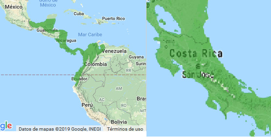
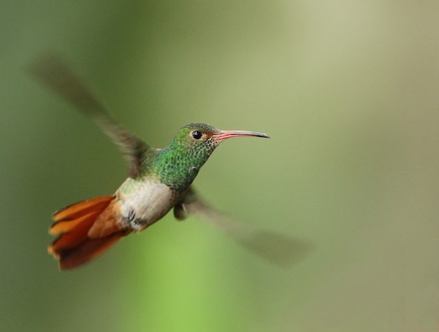
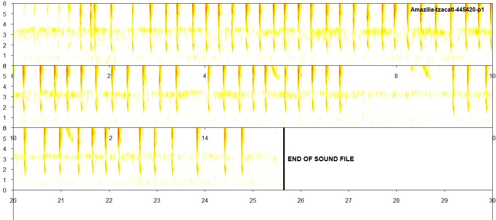
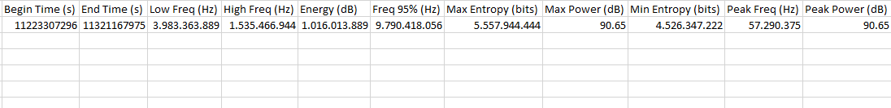

Trochilidae es el nombre que se le da a la familia de los colibríes.

Alguno de los nombres comunes que tiene son: gema de la montaña, cola dorada y colibrí. Estas aves tiene un número de adaptaciones evolutivas que van desde alimentarse de nectar de flores hasta su única habilidad de poder volar en reverso hacia cualquier dirección.

Su morfología y tamaño determinan su comportamiento de forrajeo y son características cruciales para su información. Reflejan colores radiantes e iridiscentes particularmente entre los machos como resultado de la estructura de las mismas plumas.

Los colibríes se pueden encontrar en todas los habitats disponibles en el país y la mayoría de las especies les gusta las alturas medias.

## _Amazilia tzacatl_

\

Es una especie que se distribuye desde Ecuador hasta el Sur de Mexico. Es común en hábitat alterados urbanos. En Costa Rica se distribuye en todo el pais prefiriendo bosques húmedos desde los 1600-2200msnm. Poco común en las tierras bajas del pacíficos.

\
\
\
\

{width=600px}

Mapa de distribución de _A.tzacatl_ en general y en Costa Rica.

\
\
\
\

Mide de 10-12 cm de largo, el cuello es verde con borde blanco en la hembra. La coronilla, el lomo y el costado son verdes con toque dorados. El vientre tiene un una coloración grisacea pálida y la cola es tipo rufa con la punta oscura. El pico es casi recto de color rojo y la punta negra. 
Su alimentación se compone por una variedad de flores incluyendo _Heliconia sp._ y _Musa sp._ y una pequeña ingesta de insectos para obtener proteínas
Son territoriales y de comportamiento agresivo. Según el listado de la IUCN es una especie menor preocupación.

\
\
\
\

{width=600px}

Fotografía de A. tzacatl

\
\
\
\

*Espectrograma y métricas*

{width=600px}

{width=600px}

\
Imagenes recopiladas de datazone.birdlife.org y ebird.org

