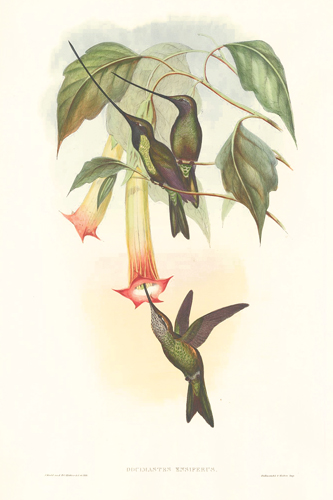

# Bienvenidos al sitio de colibríes de Costa Rica.

\
\

 Los colibríes se encuentran unicamente en el continente americano. Su mayor biodiversidad se concentra en los países ubicados en el neotrópico prefiriendo ciertos sectores sudamericanos y centroamericanos. En Costa Rica contamos con 49 especies de 343 especies descritas y algunas de ellas son endémicas del país.

\
\
\
\

{width=600px}

\
\
\
\

